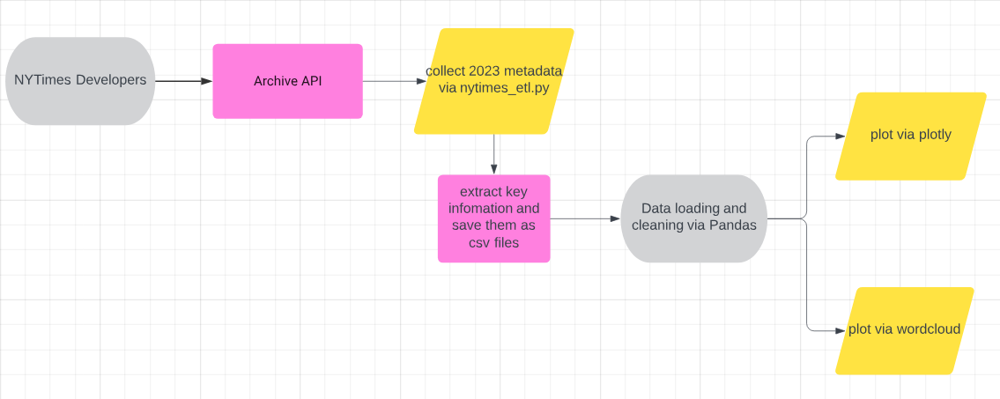
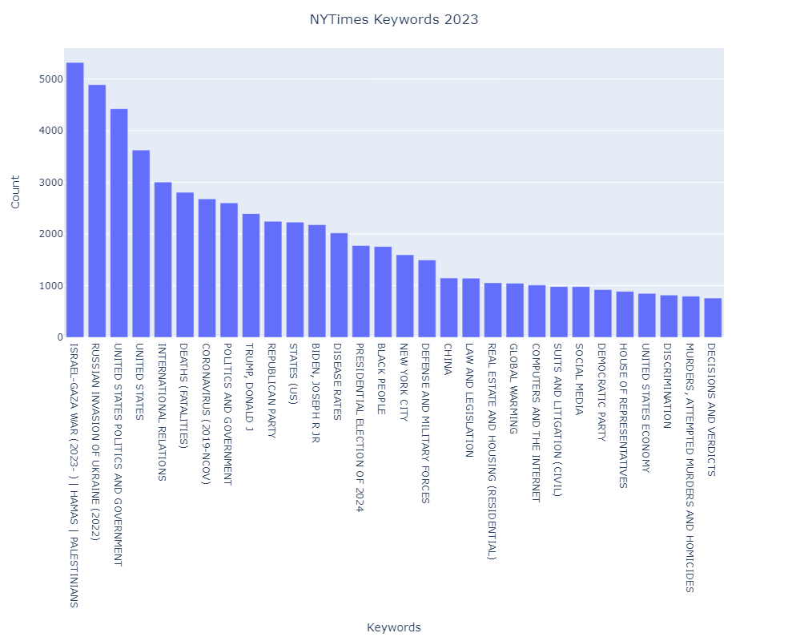
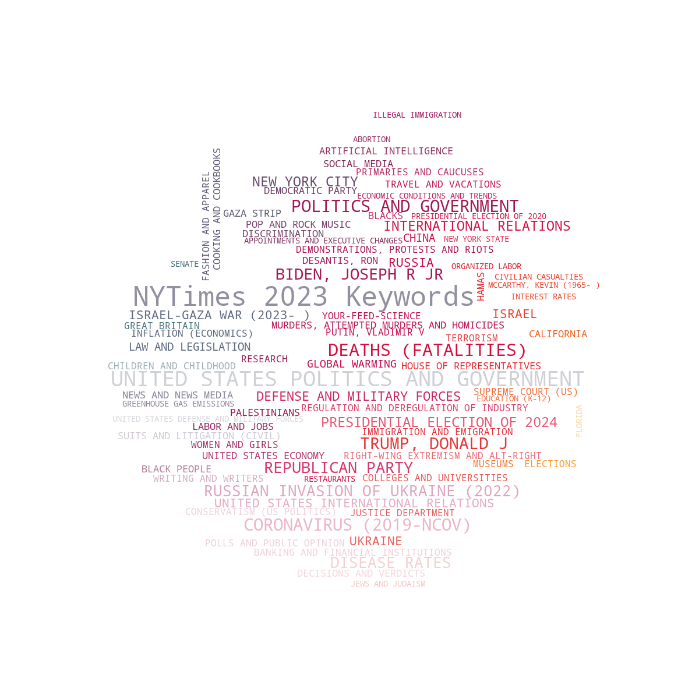

# The NY TIMES text analysis
Analyze keywords of 2023 from New York Times.  

## Workflow  
* Retrieve metadata for each month of year 2023 via NYTimes archived API  
* Performe ETL by running nytimes_etl.py
* In NY_times_analysis.ipynb, conduct data cleaning and analysis
* Visualize keywords using Plotly, and use WordCloud for generating word clouds.

### Keywords of 2023

* ISRAEL-GAZA WAR
* RUSSION-UKRAINE WAR
* UNITED STATES POLITICS AND GOVERNMENT
* INTERNATIONAL RELATIONS
* 2019-NCOV
* PRESIDENTIAL ELECTION OF 2024
* BIDEN AND TRUMP
* BLACK PEOPLE
* CHINA

